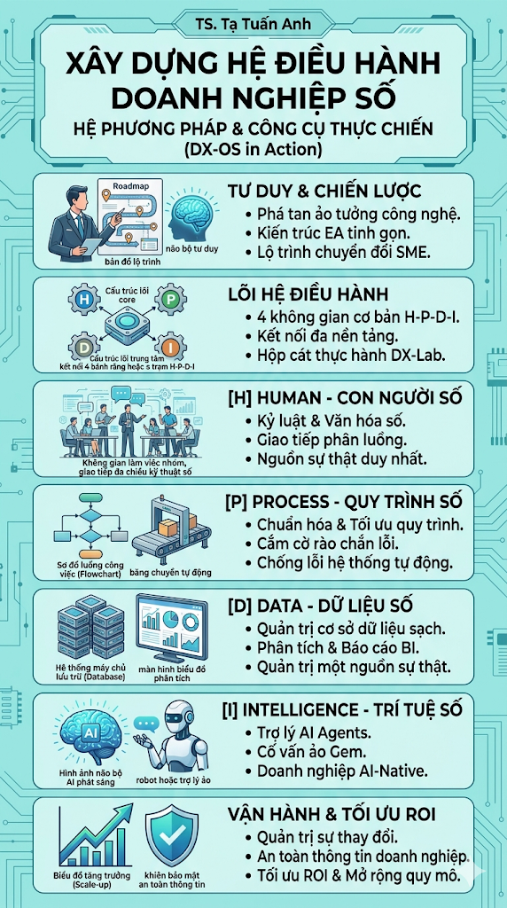

# TỔNG QUAN

<figure><figcaption></figcaption></figure>

Sách tham khảo "**Xây dựng Hệ điều hành Doanh nghiệp số: Từ Tư duy đến Hành động (DX-OS in Action)**" là một bản thiết kế kiến trúc doanh nghiệp tinh gọn, khẳng định chuyển đổi số là cuộc đại cải cách về cấu trúc và văn hóa chứ không đơn thuần là việc chi tiền mua sắm phần mềm. Xương sống của tài liệu là mô hình tiến hóa quyền lực điều khiển HPDI, giúp tổ chức dịch chuyển từ việc phụ thuộc vào bản năng con người (Human), sang tuân thủ rào chắn quy trình (Process), điều hành bằng sự thật dữ liệu (Data) và vươn tới sự tự hành của Trí tuệ nhân tạo (Intelligence). Tài liệu được thiết kế phù hợp với đặc thù của các doanh nghiệp vừa và nhỏ (SME) trên môi trường thực chiến DX-Lab, tận dụng hệ sinh thái đám mây phổ dụng để rèn thói quen kỷ luật số trước khi đầu tư lớn.

Tài liệu bao gồm 3 phần khép kín:

* Phần 1 (Tư duy chiến lược): Tái thiết lập kiến trúc doanh nghiệp, chuẩn hóa vận hành bằng kỷ luật "5 RÕ" và định hình văn hóa "3 Chuyên - 2 Thức".
* Phần 2 (Lõi Hệ điều hành): Cầm tay chỉ việc lắp ráp 4 không gian H-P-D-I qua trạm thực hành DX-Lab, từ lưu trữ P.A.R.A, tự động hóa luồng việc, trực quan hóa dữ liệu đến tích hợp AI trong doanh nghiệp.
* Phần 3 (Vận hành & Mở rộng): Cung cấp chiến thuật đánh lấn dần, xử lý phản kháng kỹ thuật số, thiết lập an toàn thông tin và tối ưu ROI để mở rộng hệ thống lên kiến trúc chuyên sâu.

Tóm lại, đây là cẩm nang thực chiến giúp doanh nghiệp đập tan "ảo tưởng công nghệ", giải phóng sức lao động và tiến tới mô hình Doanh nghiệp Tự hành (AI-Native).
