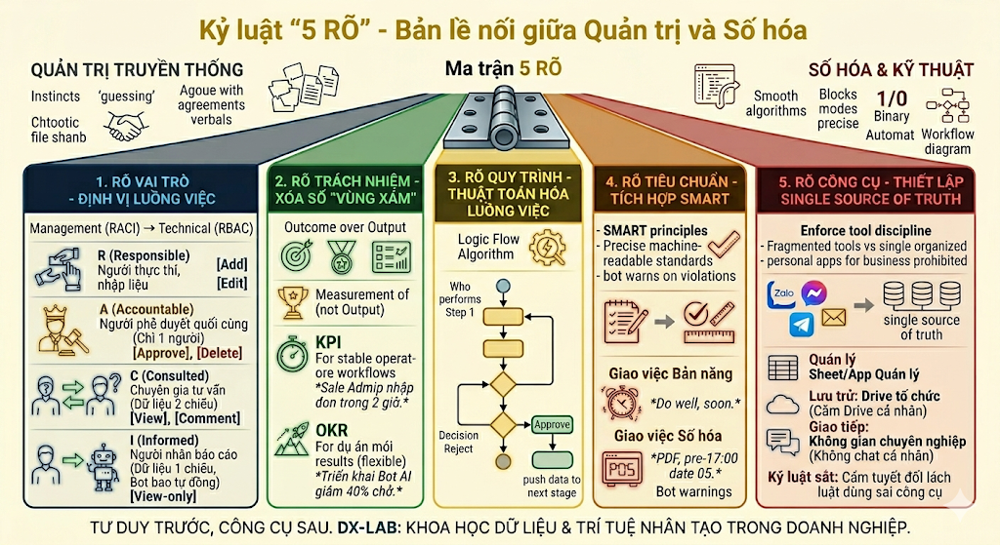

# 3.2. Kỷ luật "5 RÕ" - Bản lề nối giữa Quản trị và Số hóa

Trong thế giới quản trị truyền thống, tổ chức thường được vận hành bằng sự "linh hoạt" mang tính bản năng: nhân viên phải tự "đoán ý" lãnh đạo, các phòng ban phối hợp với nhau qua những cái gật đầu hoặc những câu chốt miệng qua loa. Nhưng máy tính và các luồng tự động hóa thì không có trí tuệ cảm xúc để thấu hiểu những điều không được viết ra. Máy móc là một hệ thống nhị phân tàn nhẫn: Hoặc là 1 (Có), hoặc là 0 (Không).

Do đó, trước khi đưa bất kỳ một công việc nào lên không gian số, tổ chức bắt buộc phải thực hiện một cuộc "Đại phẫu Quy trình" thông qua Kỷ luật 5 RÕ. Đây chính là chiếc bản lề nối liền giữa mong muốn của ban quản trị và ngôn ngữ lập trình của kỹ thuật. Ma trận 5 RÕ đóng vai trò là bộ khung thiết kế luồng việc không thể vắng mặt.

<figure><figcaption></figcaption></figure>

#### **3.2.1. Rõ Vai trò - Định vị luồng việc bằng RACI và Phân quyền RBAC**

Trong môi trường làm việc thực tế, một người có thể kiêm nhiệm nhiều việc (Ví dụ: Chị A vừa làm Kế toán, vừa kiêm Hành chính). Nhưng đối với hệ thống số, chúng ta không cấp quyền cho cá nhân "Chị A", mà cấp quyền cho Vai trò (Role).

Để triệt tiêu hoàn toàn sự chồng chéo và tâm lý đùn đẩy, Lãnh đạo cần áp dụng Ma trận RACI để định vị chính xác vị trí của từng người trong một luồng công việc:

* R (Responsible - Người thực thi): Ai là người trực tiếp xắn tay áo lên làm? Ai là người chịu trách nhiệm nhập liệu vào hệ thống?
* A (Accountable - Người phê duyệt): Ai là người "đứng mũi chịu sào" cuối cùng? Ai có quyền bấm nút "Duyệt" hoặc "Từ chối"? (Nguyên tắc tử huyệt: Mỗi tác vụ chỉ được phép có duy nhất MỘT chữ A để tránh tranh giành hoặc đùn đẩy quyền lực).
* C (Consulted - Người tư vấn): Ai là chuyên gia cần được hỏi ý kiến trước khi ra quyết định? (Luồng dữ liệu 2 chiều).
* I (Informed - Người được thông báo): Ai cần được báo cáo ngay khi công việc hoàn thành? (Luồng dữ liệu 1 chiều).

Ánh xạ từ Quản trị sang Kỹ thuật số: Ma trận RACI cung cấp dữ liệu gốc hoàn hảo để IT thiết lập hệ thống Phân quyền truy cập (RBAC - Role-Based Access Control).

* Nhóm \[R] được cấp quyền \[Add] (Thêm mới) và \[Edit] (Sửa) dữ liệu của họ.
* Nhóm \[A] được nắm quyền cao nhất: \[Approve] (Duyệt) và \[Delete] (Xóa).
* Nhóm \[C] được cấp quyền \[View] (Xem) và \[Comment] (Góp ý), khóa quyền sửa dữ liệu gốc.
* Nhóm \[I] chỉ có quyền \[View-only] (Chỉ xem) và được thiết lập làm đích đến của các luồng Bot thông báo tự động.

#### **3.2.2. Rõ Trách nhiệm - Xóa sổ "Vùng xám" bằng KPI & OKR**

Một quy trình thất bại là quy trình có những "vùng xám" - nơi công việc đổ vỡ nhưng không thể truy vết được ai là người chịu trách nhiệm cuối cùng. Trong môi trường số, trách nhiệm không đo bằng "sự cố gắng" (Output - Đầu ra cơ học), mà phải đo bằng "Kết quả cuối cùng" (Outcome).

Để lượng hóa trách nhiệm trên phần mềm, chúng ta phân tách rõ hai loại mục tiêu:

* Sử dụng KPI (Key Performance Indicator): Dành cho các luồng vận hành mang tính lặp đi lặp lại, cần sự ổn định và chính xác (thuộc về Trục P - Quy trình). Ví dụ: KPI của Sale Admin là 100% đơn hàng được nhập lên ERP trong vòng 2 giờ kể từ khi chốt deal.
* Sử dụng OKR (Objectives & Key Results): Dành cho các dự án mới, các mục tiêu mang tính đột phá đòi hỏi sự linh hoạt (thuộc về Trục H - Con người). Ví dụ: OKR quý này là triển khai thành công 1 hệ thống Bot CSKH với Key Result là giảm 40% thời gian chờ của khách.

#### **3.2.3. Rõ Quy trình - Thuật toán hóa luồng làm việc**

Máy móc hoạt động theo logic tuyến tính: If A then B (Nếu có A thì thực hiện B). Nếu Lãnh đạo không tự tay rà soát và làm "Rõ quy trình" trên giấy, các công cụ tự động hóa mạnh mẽ (như n8n hay Google Apps Script) sẽ hoàn toàn vô dụng. Bạn không thể lập trình cho một hệ thống chạy tự động nếu bạn không chỉ cho nó biết điểm bắt đầu và các ngã rẽ.

Bản vẽ thuật toán cần làm rõ:

* Bước 1 ai làm?
* Xong Bước 1 thì kích hoạt luồng thông báo cho ai ở Bước 2?
* Tại Bước 2, nếu hồ sơ bị \[Reject] (Từ chối) thì vòng lặp sẽ trả về cho ai? Nếu \[Approve] (Chấp thuận) thì dữ liệu sẽ được đẩy đi đâu?

#### **3.2.4. Rõ Tiêu chuẩn - Tích hợp nguyên tắc SMART**

Để phần mềm có thể tự động theo dõi và cảnh báo, tiêu chuẩn hoàn thành công việc phải được định nghĩa bằng các tham số đong đếm được. Một tiêu chuẩn không đạt chuẩn SMART (Cụ thể - Đo lường được - Khả thi - Phù hợp - Có thời hạn) thì không một cơ sở dữ liệu nào ghi nhận được sự thành bại của nó.

Sự khác biệt giữa giao việc "chạy bằng cơm" và giao việc "hệ thống số":

* Giao việc Bản năng (Hệ thống mù): "Em làm báo cáo doanh thu tháng này cho tốt nhé, gửi sếp sớm." → Máy tính không hiểu "cho tốt" là gì, "sớm" là mấy giờ.
* Giao việc Thực chiến (Hệ thống theo dõi được): "Báo cáo doanh thu xuất từ hệ thống, định dạng PDF, gửi vào kênh Báo Cáo trên Telegram trước 17h00 ngày 05." → Lúc này, biến số đã rõ ràng. Hệ thống sẽ tự động đối chiếu: Có file đính kèm chưa? Đã quá 17h00 chưa? Nếu vi phạm, Bot sẽ tự động réo tên người chịu trách nhiệm.

#### **3.2.5. Rõ Công cụ - Thiết lập "Nguồn sự thật duy nhất"**

Nguyên nhân cốt lõi khiến dữ liệu doanh nghiệp bị phân mảnh, thất thoát là do nhân sự làm việc tùy hứng trên mọi nền tảng: gửi file qua Zalo cá nhân, chat công việc qua Messenger, nộp báo cáo qua Email lẻ tẻ. Khi có tranh chấp hoặc sự cố, không ai biết đâu là dữ liệu chuẩn cuối cùng.

"Rõ công cụ" là yếu tố thiết lập kỷ luật thép. Doanh nghiệp phải định nghĩa được Nguồn sự thật duy nhất (Single Source of Truth) cho từng loại tác vụ:

* Giao việc/Dự án: Bắt buộc dùng Sheet hoặc ứng dụng quản lý.
* Lưu trữ tài sản số: Bắt buộc dùng Drive của tổ chức, cấm lưu trên ổ cứng cá nhân.
* Giao tiếp luồng việc: Bắt buộc dùng các không gian làm việc chuyên nghiệp, tách bạch hoàn toàn với đời sống cá nhân.

Kỷ luật sinh tử: Cấm tuyệt đối việc lách luật sử dụng sai công cụ. Nếu một báo cáo hay hợp đồng được gửi qua Zalo cá nhân thay vì luồng duyệt chính thức trên phần mềm, công việc đó được xem như chưa từng tồn tại. Dữ liệu chỉ mang giá trị pháp lý nội bộ khi nó chảy đúng trên các công cụ đã được tổ chức quy hoạch.
